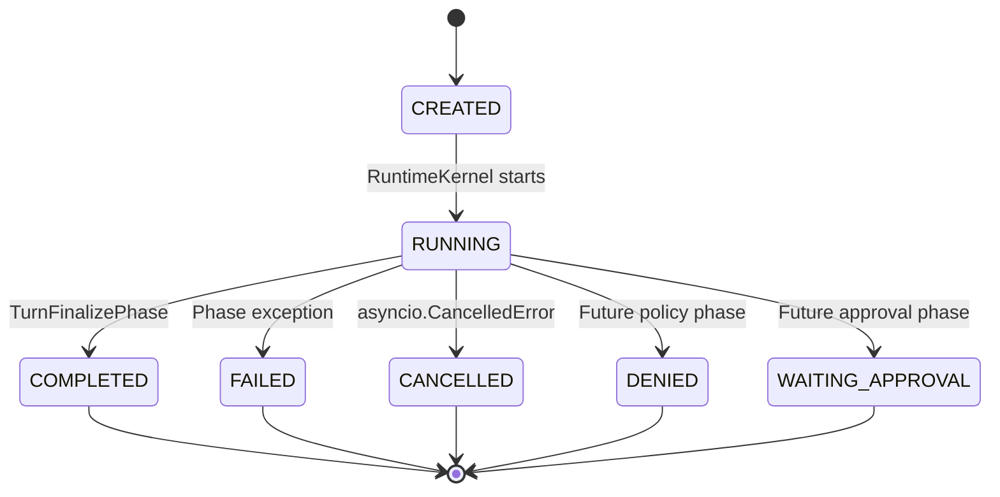

# TurnFinalizePhase 具体实现路径

> 适用范围：Cogito-Agent 初始异步 Runtime Framework  
> 目标：给出 `TurnFinalizePhase` 从设计约束、状态校验、结果构建、错误处理到测试验收的完整落地方案。

---

## 1. 结论概览

`TurnFinalizePhase` 应当被实现为一个**无外部 I/O、确定性、可重复验证的结果封装阶段**。它不负责模型调用、检索、数据库写入、MessageBus 发布或底层资源释放，而是完成以下工作：

1. 校验当前 `TurnContext` 是否具备生成结果的必要条件。
2. 将正常执行路径的状态收敛为终态。
3. 将可变的 `TurnContext` 快照化为不可变的 `TurnResult`。
4. 对 Usage、Tool Records 和允许公开的 Metadata 进行最终投影。
5. 将结果写入 `ctx.result`，供 `RuntimeKernel` 返回。
6. 对重复执行保持确定性，避免覆盖已生成但不一致的结果。

推荐的最小职责边界如下：

```text
TurnFinalizePhase
├── 校验 turn_id
├── 校验 output_text
├── 校验当前状态允许正常收敛
├── 确定最终 TurnStatus
├── 快照 UsageSummary
├── 快照 ToolExecutionRecord 列表
├── 构建安全的结果 metadata
└── 创建并写入 TurnResult
```

不应放入该阶段的逻辑：

```text
模型调用
工具执行
检索
知识抽取
数据库提交
消息总线发布
事件生命周期发布
异常吞掉或降级为伪成功
锁释放、连接关闭等无条件清理
```

---

## 2. 在 Runtime Pipeline 中的位置

默认 Pipeline：

```text
TurnInit
  → StateLoad
  → InformationRetrieval
  → ContextAssembly
  → AgentLoop
  → KnowledgeExtraction
  → Persistence
  → TurnFinalize
  → RuntimeKernel 返回 TurnResult
```

`TurnFinalizePhase` 是正常路径的最后一个 Phase，但不是整个 Turn 生命周期的最后一段代码。Phase 完成后，`RuntimeKernel` 仍需：

1. 验证 `ctx.result` 已生成。
2. 发送 `PHASE_COMPLETED(turn_finalize)`。
3. 发送 `TURN_COMPLETED`。
4. 返回 `TurnResult`。
5. 在 `finally` 中执行 `RuntimeCleanup`。

因此必须严格区分：

| 组件 | 责任 |
|---|---|
| `TurnFinalizePhase` | 构造正常路径的业务结果 |
| `RuntimeKernel` | 编排 Phase、发布生命周期事件、统一错误映射 |
| `RuntimeCleanup` | 成功、失败、取消均执行的资源清理 |
| `AgentMessageWorker` | 将结果或错误映射为 MessageBus 消息并发布 |

---

## 3. 核心设计原则

### 3.1 保持纯粹，不直接依赖基础设施

第一版建议让 `TurnFinalizePhase` 不注入 Repository、Model、MessageBus、EventSink 或 Trace Adapter。

```python
class TurnFinalizePhase(BasePhase):
    name = "turn_finalize"
```

其输入只有 `TurnContext`，输出通过修改：

```python
ctx.status
ctx.result
```

完成。

这样做的收益：

- 单元测试无需任何异步外部依赖。
- 不会与 MessageBus 或 Channel 耦合。
- 结果构建是确定性的。
- Phase 可以独立测试。
- 避免与 `RuntimeCleanup` 的资源关闭职责重叠。

### 3.2 不复制整个 `ctx.metadata`

`TurnContext.metadata` 是受限扩展区，但仍可能包含：

- 内部调试信息。
- Prompt 片段。
- 临时工具上下文。
- Adapter 对象。
- 敏感标识。
- 不可序列化对象。

因此禁止：

```python
metadata=dict(ctx.metadata)
```

应该使用明确白名单：

```python
_RESULT_METADATA_KEYS = frozenset({
    "finish_reason",
    "response_format",
    "output_language",
})
```

只将明确允许暴露的字段复制到 `TurnResult.metadata`。

### 3.3 只校验必要不变量

`TurnFinalizePhase` 不应重新检查所有上游业务逻辑。它只校验生成 `TurnResult` 必需的最小条件：

- `ctx.turn_id` 已生成。
- `ctx.output_text` 不是 `None`。
- 当前状态允许进入正常终态。
- `ctx.error` 为空。
- 已有 `ctx.result` 时，不允许产生冲突结果。

不建议在通用 Finalize 阶段强制：

```python
assert ctx.persistence_completed is True
```

原因：

1. `PersistencePhase` 如果失败，Kernel 本来就不会继续执行 Finalize。
2. 测试 Pipeline 可能使用 Recording Phase 或 No-op Persistence。
3. 将来 `DENIED`、`WAITING_APPROVAL` 等路径可能不需要完整持久化。
4. 是否必须持久化属于具体运行策略，而不是通用结果封装职责。

如果生产环境要求“成功响应必须已持久化”，应通过独立策略校验器或 `PersistencePhase` 自身保证。

### 3.4 `None` 与空字符串必须区分

推荐只把 `None` 视为缺少模型输出：

```python
if ctx.output_text is None:
    raise InvalidTurnStateError(...)
```

不要写：

```python
if not ctx.output_text:
```

因为空字符串可能是某些非文本响应、工具驱动响应或特殊 Channel 映射中的合法值。是否允许空文本应由更上层的 Response Policy 决定。

---

## 4. 状态收敛设计

### 4.1 第一版推荐规则

初始框架的正常路径只需要支持：

```text
RUNNING → COMPLETED
```

以下状态不得由正常 `TurnFinalizePhase` 收敛：

```text
FAILED
CANCELLED
CREATED
```

原因：

- `FAILED` 由 Kernel 的异常路径处理。
- `CANCELLED` 必须保留 `asyncio.CancelledError` 语义。
- `CREATED` 表示 Pipeline 并未正常开始。

### 4.2 后续扩展规则

未来加入 Policy 或 Approval Phase 后，可以扩展：

```text
RUNNING          → COMPLETED
DENIED           → DENIED
WAITING_APPROVAL → WAITING_APPROVAL
COMPLETED        → COMPLETED（仅用于幂等重入）
```

建议把终态推导封装为单独私有方法：

```python
def _resolve_final_status(self, ctx: TurnContext) -> TurnStatus:
    ...
```

### 4.3 状态机示意



---

## 5. 数据映射规则

### 5.1 字段映射表

| `TurnResult` 字段 | 来源 | 规则 |
|---|---|---|
| `turn_id` | `ctx.turn_id` | 必须非空 |
| `request_id` | `ctx.request.request_id` | 原样复制 |
| `session_id` | `ctx.request.session_id` | 原样复制 |
| `actor_id` | `ctx.request.actor_id` | 原样复制 |
| `status` | 状态收敛函数 | 第一版为 `COMPLETED` |
| `text` | `ctx.output_text` | 只要求不是 `None` |
| `usage` | `ctx.usage` | 使用不可变快照 |
| `tool_records` | `ctx.tool_records` | 转换为 `tuple` |
| `metadata` | 白名单投影 | 不复制整个 Context Metadata |

### 5.2 为什么 Tool Records 必须转为 tuple

`TurnContext` 在运行期是可变对象：

```python
tool_records: list[ToolExecutionRecord]
```

`TurnResult` 应是不可变快照：

```python
tool_records: tuple[ToolExecutionRecord, ...]
```

必须在 Finalize 时转换：

```python
tool_records=tuple(ctx.tool_records)
```

这样 Finalize 后继续修改 `ctx.tool_records` 不会污染已经生成的结果。

### 5.3 Usage 的处理

`UsageSummary` 已设计为冻结的 dataclass，因此可以直接引用：

```python
usage=ctx.usage
```

如果未来 `UsageSummary` 改为可变对象，应在 Finalize 中显式复制：

```python
UsageSummary(
    input_tokens=ctx.usage.input_tokens,
    output_tokens=ctx.usage.output_tokens,
    total_tokens=ctx.usage.total_tokens,
    model_calls=ctx.usage.model_calls,
    tool_calls=ctx.usage.tool_calls,
)
```

第一版不建议在 Finalize 中自动修正 Usage，例如：

```python
total_tokens = input_tokens + output_tokens
```

原因是静默修正会掩盖上游统计错误。应由 Usage 聚合组件保证一致性，或由 Finalize 明确抛出状态错误。

---

## 6. 推荐错误模型

建议在 `cogito_agent/runtime/errors.py` 中增加一个通用状态错误：

```python
from __future__ import annotations


class InvalidTurnStateError(RuntimeAgentError):
    code = "INVALID_TURN_STATE"
    retryable = False
```

可选的更细粒度错误：

```python
class MissingTurnIdError(InvalidTurnStateError):
    code = "MISSING_TURN_ID"


class MissingOutputTextError(InvalidTurnStateError):
    code = "MISSING_OUTPUT_TEXT"


class ConflictingTurnResultError(InvalidTurnStateError):
    code = "CONFLICTING_TURN_RESULT"
```

初始框架可以只实现 `InvalidTurnStateError`，通过安全消息区分场景，避免错误类型过多。

错误消息建议：

| 场景 | 内部 message | safe_message |
|---|---|---|
| 缺少 turn_id | `turn_id is required before finalization` | `Agent turn could not be finalized` |
| 缺少 output_text | `output_text is None before finalization` | `Agent response is incomplete` |
| 当前状态非法 | `cannot finalize turn from status=failed` | `Agent turn could not be finalized` |
| 已有冲突结果 | `existing TurnResult conflicts with candidate result` | `Agent turn result is inconsistent` |

不得把完整 Context、Prompt、异常堆栈放入 `safe_message`。

---

## 7. 推荐代码实现

### 7.1 最小可用版本

文件：

```text
cogito_agent/runtime/phases/turn_finalize.py
```

实现：

```python
from __future__ import annotations

from collections.abc import Mapping

from cogito_agent.runtime.context import TurnContext
from cogito_agent.runtime.errors import InvalidTurnStateError
from cogito_agent.runtime.models import TurnResult, TurnStatus
from cogito_agent.runtime.phase import BasePhase


class TurnFinalizePhase(BasePhase):
    name = "turn_finalize"

    _RESULT_METADATA_KEYS = frozenset({
        "finish_reason",
        "response_format",
        "output_language",
    })

    async def execute(self, ctx: TurnContext) -> None:
        turn_id = self._require_turn_id(ctx)
        output_text = self._require_output_text(ctx)
        final_status = self._resolve_final_status(ctx)

        candidate = TurnResult(
            turn_id=turn_id,
            request_id=ctx.request.request_id,
            session_id=ctx.request.session_id,
            actor_id=ctx.request.actor_id,
            status=final_status,
            text=output_text,
            usage=ctx.usage,
            tool_records=tuple(ctx.tool_records),
            metadata=self._build_result_metadata(ctx.metadata),
        )

        self._store_result(ctx, candidate)
        ctx.status = final_status

    @staticmethod
    def _require_turn_id(ctx: TurnContext) -> str:
        if ctx.turn_id is None or not ctx.turn_id.strip():
            raise InvalidTurnStateError(
                "turn_id is required before finalization",
                safe_message="Agent turn could not be finalized",
            )
        return ctx.turn_id

    @staticmethod
    def _require_output_text(ctx: TurnContext) -> str:
        if ctx.output_text is None:
            raise InvalidTurnStateError(
                "output_text is None before finalization",
                safe_message="Agent response is incomplete",
            )
        return ctx.output_text

    @staticmethod
    def _resolve_final_status(ctx: TurnContext) -> TurnStatus:
        if ctx.error is not None:
            raise InvalidTurnStateError(
                "cannot finalize a turn containing an error",
                safe_message="Agent turn could not be finalized",
            )

        if ctx.status is TurnStatus.RUNNING:
            return TurnStatus.COMPLETED

        if ctx.status is TurnStatus.COMPLETED:
            return TurnStatus.COMPLETED

        raise InvalidTurnStateError(
            f"cannot finalize turn from status={ctx.status}",
            safe_message="Agent turn could not be finalized",
        )

    @classmethod
    def _build_result_metadata(
        cls,
        source: Mapping[str, object],
    ) -> dict[str, object]:
        return {
            key: source[key]
            for key in cls._RESULT_METADATA_KEYS
            if key in source
        }

    @staticmethod
    def _store_result(
        ctx: TurnContext,
        candidate: TurnResult,
    ) -> None:
        if ctx.result is None:
            ctx.result = candidate
            return

        if ctx.result == candidate:
            return

        raise InvalidTurnStateError(
            "existing TurnResult conflicts with candidate result",
            safe_message="Agent turn result is inconsistent",
        )
```

### 7.2 为什么 `execute()` 仍然是 async

即使当前实现没有 I/O，仍应保持：

```python
async def execute(...)
```

原因是所有 Phase 统一遵循 `RuntimePhase` 协议，Kernel 不需要为同步和异步 Phase 建立两套调用路径。

### 7.3 为什么不在 Phase 内发送事件

以下事件由 Kernel 统一发送：

```text
PHASE_STARTED(turn_finalize)
PHASE_COMPLETED(turn_finalize)
TURN_COMPLETED
```

因此不要给 `TurnFinalizePhase` 注入 `AgentEventSink`，也不要写：

```python
await self._event_sink.emit(...)
```

否则会导致事件重复、顺序不一致，并削弱 Kernel 对生命周期的统一控制。

---

## 8. RuntimeKernel 的配套调整

### 8.1 避免结果状态不一致

原始 Kernel 流程通常是：

```python
for phase in self._phases:
    await phase.run(ctx)

if ctx.result is None:
    raise MissingTurnResultError()

ctx.status = TurnStatus.COMPLETED
return ctx.result
```

如果 Finalize 在 `ctx.status == RUNNING` 时直接复制状态，生成的 `TurnResult.status` 会错误地保持为 `RUNNING`。

推荐约束：

- Finalize 负责把正常路径状态设置为 `COMPLETED`。
- Kernel 在 Phase 完成后只做防御性确认，不重新构造结果。

建议代码：

```python
if ctx.result is None:
    raise MissingTurnResultError()

if ctx.result.status is not ctx.status:
    raise InvalidTurnStateError(
        "TurnResult status does not match TurnContext status",
        safe_message="Agent turn result is inconsistent",
    )

await emit_safely(self._events.turn_completed(ctx))
return ctx.result
```

如果保留 Kernel 中的：

```python
ctx.status = TurnStatus.COMPLETED
```

也必须确保 Finalize 构造 `TurnResult` 时明确使用：

```python
status=TurnStatus.COMPLETED
```

不能使用：

```python
status=ctx.status
```

### 8.2 Cleanup 仍然必须在 finally 中执行

```python
finally:
    await self._cleanup.run(ctx)
```

Finalize 不得替代 Cleanup。

即使 Finalize 自身失败，Cleanup 也必须执行：

```text
TurnFinalizePhase 抛错
→ PHASE_FAILED(turn_finalize)
→ TURN_FAILED
→ RuntimeErrorMapper
→ finally
→ RuntimeCleanup
```

---

## 9. Trace 和完成时间的处理

### 9.1 推荐第一版方案

第一版不在 `TurnFinalizePhase` 中直接调用 Trace Port。

建议：

- `TurnInitPhase` 创建 `trace_id`。
- 各 Phase 更新观察字段。
- `TurnFinalizePhase` 构建逻辑结果。
- `DefaultRuntimeCleanup` 使用幂等方式结束 Trace。
- `DefaultRuntimeCleanup` 设置 `ctx.completed_at`。

理由：Cleanup 在成功、失败、取消路径都执行，最适合作为 Trace 关闭的统一出口。

### 9.2 如果必须在正常路径结束 Trace

若规范要求 Finalize 完成正常 Trace，而 Cleanup 兜底异常路径，需要增加明确状态：

```python
trace_ended: bool = False
```

正常路径：

```python
await trace.end_turn(
    trace_id=ctx.trace_id,
    status=ctx.status.value,
)
ctx.trace_ended = True
```

Cleanup：

```python
if ctx.trace_id is not None and not ctx.trace_ended:
    await trace.end_turn(
        trace_id=ctx.trace_id,
        status=ctx.status.value,
    )
    ctx.trace_ended = True
```

不要使用不透明的：

```python
ctx.metadata["trace_ended"] = True
```

如果该字段影响生命周期正确性，应升级为 `TurnContext` 正式字段。

---

## 10. 幂等性策略

Phase 正常情况下只执行一次，但应防御以下情况：

- 测试代码误调用两次。
- Worker 重试过程中复用了 Context。
- 未来增加恢复机制。
- Kernel Bug 导致重复进入 Finalize。

推荐策略：

```text
没有 ctx.result
    → 写入 candidate

已有 ctx.result 且与 candidate 完全相同
    → no-op

已有 ctx.result 但与 candidate 不同
    → 抛 ConflictingTurnResultError
```

不推荐无条件覆盖：

```python
ctx.result = candidate
```

因为这会掩盖上游在 Finalize 后继续修改 Context 的错误。

---

## 11. 单元测试设计

建议新增：

```text
tests/unit/runtime/phases/test_turn_finalize.py
```

### 11.1 基础 Fixture

```python
from __future__ import annotations

from cogito_agent.runtime.context import TurnContext
from cogito_agent.runtime.models import (
    AgentRequest,
    TurnStatus,
    ToolExecutionRecord,
    UsageSummary,
)


def make_context() -> TurnContext:
    ctx = TurnContext(
        request=AgentRequest(
            request_id="request-1",
            session_id="session-1",
            actor_id="actor-1",
            text="hello",
        )
    )
    ctx.turn_id = "turn-1"
    ctx.status = TurnStatus.RUNNING
    ctx.output_text = "final answer"
    ctx.usage = UsageSummary(
        input_tokens=10,
        output_tokens=20,
        total_tokens=30,
        model_calls=2,
        tool_calls=1,
    )
    ctx.tool_records.append(
        ToolExecutionRecord(
            call_id="call-1",
            tool_name="search",
            succeeded=True,
            duration_ms=15,
        )
    )
    return ctx
```

### 11.2 正常结果构建

验证：

```python
async def test_finalize_builds_turn_result() -> None:
    ctx = make_context()
    phase = TurnFinalizePhase()

    await phase.run(ctx)

    assert ctx.status is TurnStatus.COMPLETED
    assert ctx.result is not None
    assert ctx.result.turn_id == "turn-1"
    assert ctx.result.request_id == "request-1"
    assert ctx.result.session_id == "session-1"
    assert ctx.result.actor_id == "actor-1"
    assert ctx.result.text == "final answer"
    assert ctx.result.status is TurnStatus.COMPLETED
    assert ctx.result.usage.total_tokens == 30
    assert len(ctx.result.tool_records) == 1
```

### 11.3 缺少 turn_id

```python
async def test_finalize_rejects_missing_turn_id() -> None:
    ctx = make_context()
    ctx.turn_id = None

    with pytest.raises(InvalidTurnStateError):
        await TurnFinalizePhase().run(ctx)
```

### 11.4 缺少 output_text

```python
async def test_finalize_rejects_missing_output_text() -> None:
    ctx = make_context()
    ctx.output_text = None

    with pytest.raises(InvalidTurnStateError):
        await TurnFinalizePhase().run(ctx)
```

### 11.5 空字符串可被保留

```python
async def test_finalize_preserves_empty_output_text() -> None:
    ctx = make_context()
    ctx.output_text = ""

    await TurnFinalizePhase().run(ctx)

    assert ctx.result is not None
    assert ctx.result.text == ""
```

### 11.6 Tool Records 是快照

```python
async def test_tool_records_are_snapshotted() -> None:
    ctx = make_context()

    await TurnFinalizePhase().run(ctx)
    assert ctx.result is not None

    ctx.tool_records.clear()

    assert len(ctx.result.tool_records) == 1
```

### 11.7 Metadata 白名单

```python
async def test_result_metadata_uses_allowlist() -> None:
    ctx = make_context()
    ctx.metadata.update({
        "finish_reason": "stop",
        "system_prompt": "secret",
        "adapter_object": object(),
    })

    await TurnFinalizePhase().run(ctx)

    assert ctx.result is not None
    assert ctx.result.metadata == {"finish_reason": "stop"}
```

### 11.8 重复执行保持幂等

```python
async def test_finalize_is_idempotent_for_same_context() -> None:
    ctx = make_context()
    phase = TurnFinalizePhase()

    await phase.run(ctx)
    first = ctx.result

    await phase.run(ctx)

    assert ctx.result is first
```

### 11.9 结果冲突时失败

```python
async def test_finalize_rejects_conflicting_existing_result() -> None:
    ctx = make_context()
    phase = TurnFinalizePhase()

    await phase.run(ctx)
    ctx.output_text = "changed after finalization"

    with pytest.raises(InvalidTurnStateError):
        await phase.run(ctx)
```

### 11.10 错误状态不得正常完成

参数化测试：

```python
@pytest.mark.parametrize(
    "status",
    [
        TurnStatus.CREATED,
        TurnStatus.FAILED,
        TurnStatus.CANCELLED,
    ],
)
async def test_finalize_rejects_invalid_status(
    status: TurnStatus,
) -> None:
    ctx = make_context()
    ctx.status = status

    with pytest.raises(InvalidTurnStateError):
        await TurnFinalizePhase().run(ctx)
```

---

## 12. Kernel 集成测试

除 Phase 单测外，还应在 `test_kernel.py` 中覆盖完整交互。

### 12.1 正常事件顺序

期望：

```text
TURN_STARTED
PHASE_STARTED(turn_finalize)
PHASE_COMPLETED(turn_finalize)
TURN_COMPLETED
```

在完整八阶段测试中，应确认 `TURN_COMPLETED` 只在 Finalize 生成结果后出现。

### 12.2 Finalize 失败

构造前序 Phase 不写 `output_text`，确认：

- `TurnFinalizePhase` 抛 `InvalidTurnStateError`。
- 发出 `PHASE_FAILED(turn_finalize)`。
- 不发出 `PHASE_COMPLETED(turn_finalize)`。
- 发出 `TURN_FAILED`。
- Cleanup 仍然执行。
- Kernel 不返回伪造 `TurnResult`。

### 12.3 缺失 Finalize Phase

使用一个没有写 `ctx.result` 的 Pipeline，确认 Kernel 抛：

```text
MissingTurnResultError
```

这验证 Kernel 不依赖固定的八个 Phase 名称，而只依赖最终不变量。

---

## 13. 文件级落地清单

### 13.1 必改文件

```text
cogito_agent/runtime/phases/turn_finalize.py
cogito_agent/runtime/errors.py
tests/unit/runtime/phases/test_turn_finalize.py
tests/unit/runtime/test_kernel.py
```

### 13.2 可能需要调整

```text
cogito_agent/runtime/kernel.py
cogito_agent/runtime/context.py
cogito_agent/bootstrap/runtime_factory.py
```

调整条件：

| 文件 | 何时调整 |
|---|---|
| `kernel.py` | 需要校验 Context/Result 状态一致性 |
| `context.py` | 需要增加正式 `trace_ended` 字段 |
| `runtime_factory.py` | Finalize 新增显式依赖时 |
| `errors.py` | 增加状态或结果冲突错误 |

### 13.3 不应修改

```text
application/messaging/*
Channel Adapter
MessageBus Adapter
Repository Adapter
Model Adapter
Retriever Adapter
```

Finalize 的实现不需要这些组件。

---

## 14. 分阶段实施路径

### Step 1：确定 Finalize 不变量

先在代码评审中锁定：

```text
turn_id 必须存在
output_text 必须不是 None
ctx.error 必须为空
RUNNING 才能正常收敛为 COMPLETED
TurnResult 必须是 Context 的不可变快照
```

### Step 2：实现错误类型

在 `runtime/errors.py` 中加入 `InvalidTurnStateError`，并确保默认 Error Mapper 可以将其稳定映射为：

```json
{
  "code": "INVALID_TURN_STATE",
  "safe_message": "Agent turn could not be finalized",
  "retryable": false
}
```

### Step 3：实现纯 Finalize Phase

先不注入任何 Port，实现：

- 输入校验。
- 状态收敛。
- Metadata 白名单。
- Result 构建。
- 幂等写入。

### Step 4：校正 Kernel 状态时序

确保：

```text
TurnResult.status == ctx.status
```

并确认 `TURN_COMPLETED` 在结果生成后发出。

### Step 5：完成 Phase 单元测试

优先完成：

1. 正常构建。
2. 缺少 turn_id。
3. 缺少 output_text。
4. Metadata 安全投影。
5. Tool Records 快照。
6. 幂等执行。
7. 冲突结果。
8. 非法状态。

### Step 6：完成 Kernel 集成测试

验证：

- Finalize 成功后返回结果。
- Finalize 失败后事件和 Cleanup 正确。
- 没有 Finalize 或没有结果时抛 `MissingTurnResultError`。

### Step 7：运行质量门禁

推荐：

```bash
pytest
mypy cogito_agent
ruff check cogito_agent tests
ruff format --check cogito_agent tests
```

---

## 15. 常见错误与规避方式

### 15.1 在 Finalize 中发布 MessageBus 消息

错误：

```python
await publisher.publish(...)
```

问题：Kernel 会与 MessageBus 绑定，破坏 Application 边界。

正确方式：Worker 在 `AgentApplicationService.process()` 返回后发布。

### 15.2 在 Finalize 中吞掉缺少结果的错误

错误：

```python
if ctx.output_text is None:
    ctx.output_text = ""
```

问题：制造伪成功，掩盖 AgentLoop 未实现或失败。

正确方式：抛稳定 Runtime Error。

### 15.3 复制全部 Metadata

错误：

```python
metadata=ctx.metadata
```

问题：可能泄漏内部对象、Prompt 或敏感数据，而且结果会引用可变字典。

正确方式：白名单复制并创建新字典。

### 15.4 使用 `if not ctx.output_text`

问题：将合法空字符串误判为缺失。

正确方式：

```python
if ctx.output_text is None:
```

### 15.5 Finalize 和 Cleanup 同时关闭同一资源

问题：Trace、锁或连接可能被重复关闭，且错误路径不一致。

正确方式：统一由幂等 Cleanup 关闭；若必须在 Finalize 正常关闭，增加正式状态字段并让 Cleanup 兜底。

### 15.6 结果生成后继续修改 Context

问题：

```python
await finalize.run(ctx)
ctx.output_text = "new value"
```

会造成 Context 与 Result 不一致。

规避：

- Finalize 必须是最后一个业务 Phase。
- Kernel 完成 Finalize 后不得运行修改结果字段的 Phase。
- 重复 Finalize 时检测冲突。

### 15.7 在 Kernel 中针对 Phase 名称写分支

错误：

```python
if phase.name == "turn_finalize":
    ...
```

问题：Kernel 开始感知具体业务 Phase，破坏可扩充性。

正确方式：Kernel 只验证最终 `ctx.result` 不变量。

---

## 16. 可选的生产级增强

以下增强不建议在第一版全部加入，但可作为演进方向。

### 16.1 Finalization Policy

当终态变多时，可以注入纯策略对象：

```python
class TurnFinalizationPolicy(Protocol):
    def resolve_status(self, ctx: TurnContext) -> TurnStatus:
        ...

    def build_metadata(
        self,
        ctx: TurnContext,
    ) -> Mapping[str, object]:
        ...
```

该策略必须保持同步、无 I/O。

### 16.2 输出类型扩展

当前 `TurnResult` 只有：

```python
text: str
```

未来需要附件、结构化结果或多模态输出时，应扩展正式 DTO，而不是把所有内容塞入 Metadata：

```python
@dataclass(frozen=True, slots=True)
class AgentOutput:
    text: str
    attachments: tuple[AttachmentRef, ...] = ()
    structured_data: Mapping[str, object] = field(default_factory=dict)
```

### 16.3 结果完整性哈希

在需要审计或跨系统幂等时，可以基于稳定字段计算结果摘要，但应放在 Application 或 Persistence 边界，不要让基础 Finalize 依赖加密或 MessageBus 细节。

### 16.4 完成原因枚举

把字符串 `finish_reason` 升级为强类型：

```python
class FinishReason(StrEnum):
    STOP = "stop"
    MAX_TOOL_ROUNDS = "max_tool_rounds"
    POLICY_DENIED = "policy_denied"
    WAITING_APPROVAL = "waiting_approval"
```

这比长期依赖任意 Metadata 字符串更稳定。

---

## 17. 验收标准

完成实现后，应满足：

- [ ] `TurnFinalizePhase` 不导入 MessageBus、Channel、Repository 或 Model Adapter。
- [ ] `TurnFinalizePhase` 不执行外部 I/O。
- [ ] 缺少 `turn_id` 时明确失败。
- [ ] 缺少 `output_text` 时明确失败。
- [ ] 不把空字符串自动视为错误。
- [ ] 正常路径将状态收敛为 `COMPLETED`。
- [ ] `TurnResult.status` 与 `TurnContext.status` 一致。
- [ ] Tool Records 被转换为不可变 tuple。
- [ ] Metadata 只按白名单公开。
- [ ] 不复制内部异常、Prompt 或 Adapter 对象。
- [ ] 重复执行同一 Finalize 是幂等的。
- [ ] 冲突结果不会被静默覆盖。
- [ ] Finalize 失败时 Kernel 发出 `PHASE_FAILED` 和 `TURN_FAILED`。
- [ ] Finalize 失败时 Cleanup 仍执行。
- [ ] Kernel 不包含针对 `turn_finalize` 名称的业务分支。
- [ ] 完整测试通过类型检查、lint 和 pytest。

---

## 18. 最终推荐实现边界

推荐最终结构：

```text
TurnFinalizePhase
    输入：TurnContext
    依赖：无外部 Port
    输出：
        ctx.status = terminal status
        ctx.result = immutable TurnResult

RuntimeKernel
    检查 ctx.result
    发送 TURN_COMPLETED / TURN_FAILED
    返回结果或映射错误

RuntimeCleanup
    finally 中执行
    关闭 Trace
    释放锁和临时资源
    写入 completed_at

AgentMessageWorker
    TurnResult → MessageEnvelope
    发布到 reply_to / agent.output
```

这一实现方式使 `TurnFinalizePhase` 保持简单、可测、稳定，同时保留未来对拒绝、人工审批、多模态输出和更多终态的扩展空间。
